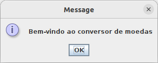
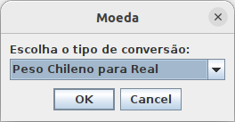
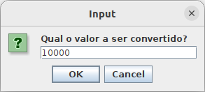
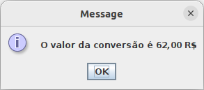

# Conversor De Moedas

<h1>Descrição do projeto</h1>

Quarta Challenge do programa One + Alura, que visa projetar um conversor de moedas usando Java

<h2>Funcionalidade do projeto</h2>
<ul>

<li>Inicio: </li>
 

 
 
<li>Escolher moeda a ser convertida: </li>
 

 
 
</ul>
<li>Escolher valor a ser convertido: </li>
 

 
 
<li>Resultado: </li>
 

 
 
<h2>Requisitos</h2>
<ol>
<li>Deve convertar para as seguintes moedas: 
  <ul>
  <li>Real para Dólar</li>
  <li>Real para Euro</li>
  <li>Real para Libra Esterlinas</li>
  <li>Real para Peso Argentino</li>
  <li>Real para Peso Chileno</li>
  </ul>
</li>
<li>Deve converter ao contrário também
<ul>
<li>Dólar para Real</li>
  <li>Euro para Real</li>
  <li>Libra Esterlinas para Real</li>
  <li>Peso Argentino para Real</li>
  <li>Peso Chileno para Real</li>
</ul>
</li>
</ol>
